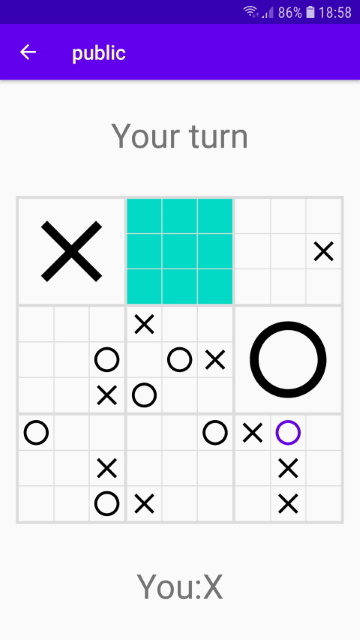
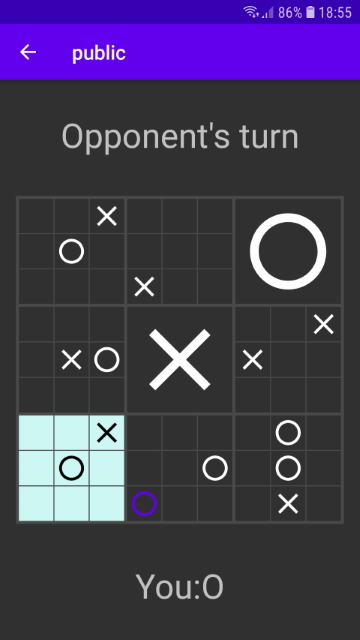

# Tic Tac Toe 9x9-mobile
Mobile version of Tic Tac Toe 9x9 game.

## Table of contents
- [General info](#general-info)
- [Screenshots](#screenshots)
- [Setup](#setup)
- [Features](#features)
- [Technologies](#technologies)
- [Contact](#contact)

## General info
Tic Tac Toe 9x9 game for Your phone or tablet. Win by acquiring three 3x3 fields horizontally, vertically or diagonally. For full rules click [here](https://pikne-programy.github.io/9x9-mobile/).

## Screenshots
 

## Setup
To install this app just go to https://github.com/Pikne-Programy/9x9-mobile/releases, choose the latest version and download the attached apk file. For more detailed instruction go [here](https://pikne-programy.github.io/9x9-mobile/).

***Disclaimer:***
Minimal Android version necessary to run this app is Android 6.0 (Marshmallow).

## Features
- Private rooms
- Different App Themes (Light and Dark)
- Notification on Your turn (Sound and/or vibration)

## Technologies
- [Kotlin](https://kotlinlang.org/) version: 1.3.71
- [Gson](https://github.com/google/gson) version: 2.8.6
- [AndroidX Preference eXtended](https://github.com/takisoft/preferencex-android) version: 1.1.0
- [OkHttp](https://square.github.io/okhttp/) version: 4.4.1

## Contact
If you have any questions or suggestions feel free to contact me - wasacz.dev@gmail.com!
