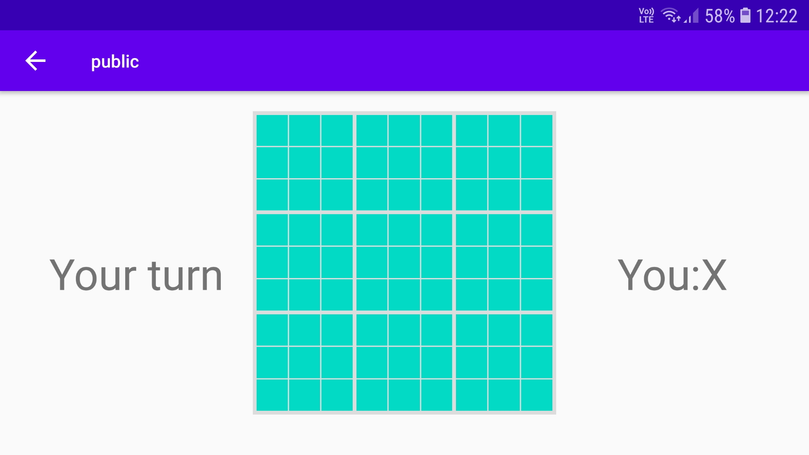
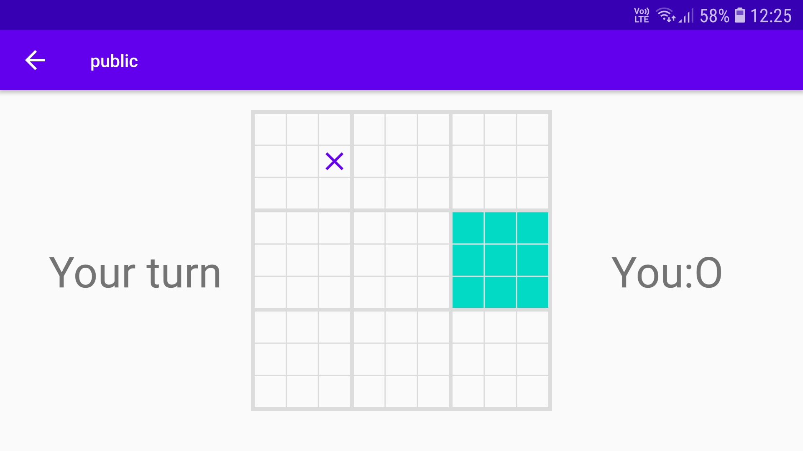
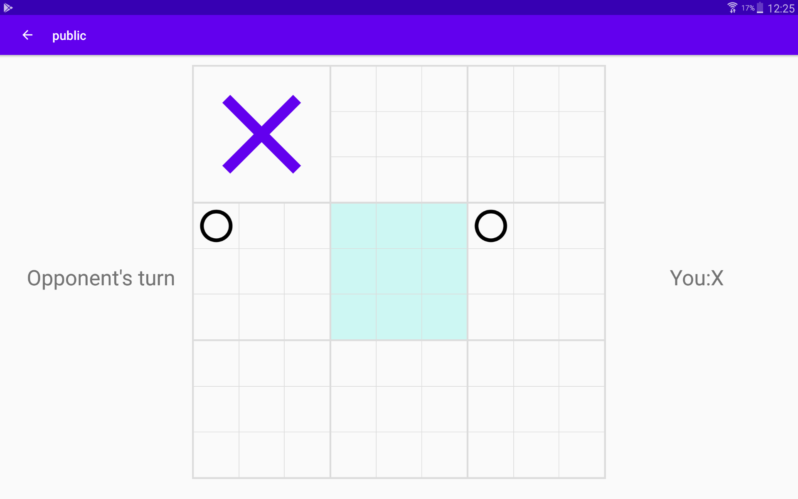
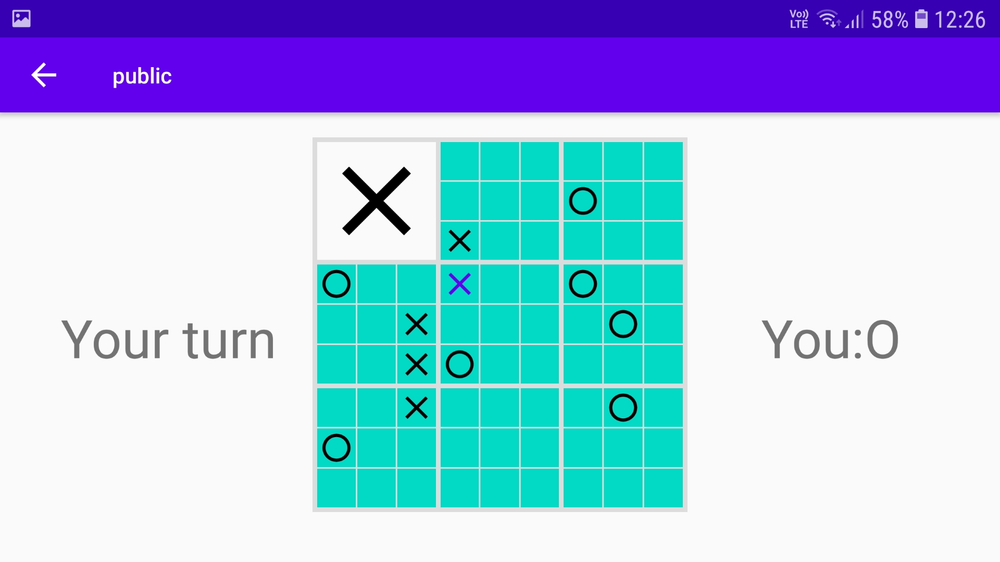
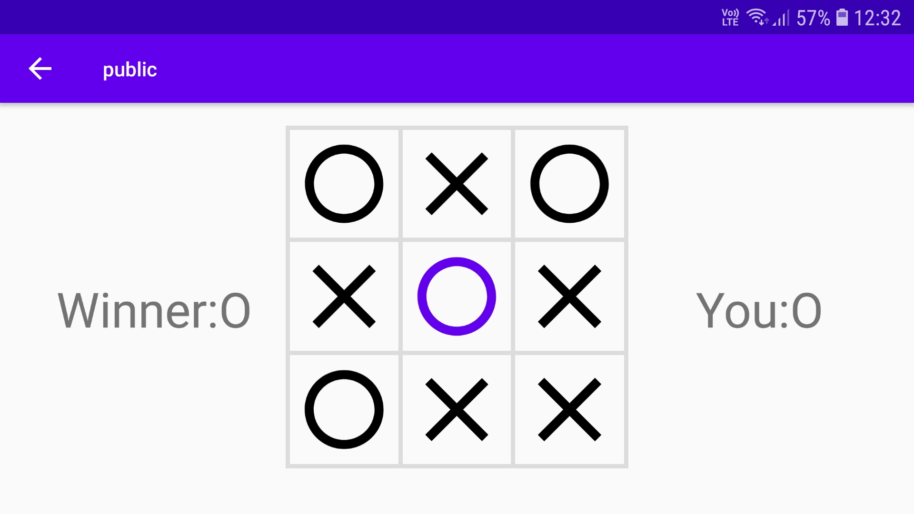

# Welcome

Thank you for your visit on our website.

## Game Rules

1. The game starts with Player X placing his symbol wherever he wants.

2. Now Player O has to place his symbol in the marked subboard corresponding to the field taken by Player X.

3. When a player places 3 of his symbols in a row (vertically, horizontally or diagonally - just like in the standart Tic Tac Toe Game) he wins the entire subboard.

4. When a player has to place his symbol in the board which is already won (or there is a tie) he can choose one of the remaining fields in all subboards.

5. The game ends when one of the players wins 3 subboards in a row or there is a tie.

## Report a bug

Click [here](https://github.com/Pikne-Programy/9x9-mobile/issues/new?assignees=miloszwasacz&labels=bug&template=bug_report.md&title=%5BBUG%5D) to report a bug.

## Suggest a new feature

Click [here](https://github.com/Pikne-Programy/9x9-mobile/issues/new?assignees=miloszwasacz&labels=enhancement&template=feature_request.md&title=%5BREQUEST%5D) to submit a feature request.

## Contact
If you have any questions or suggestions feel free to contact me - wasacz.dev@gmail.com!
